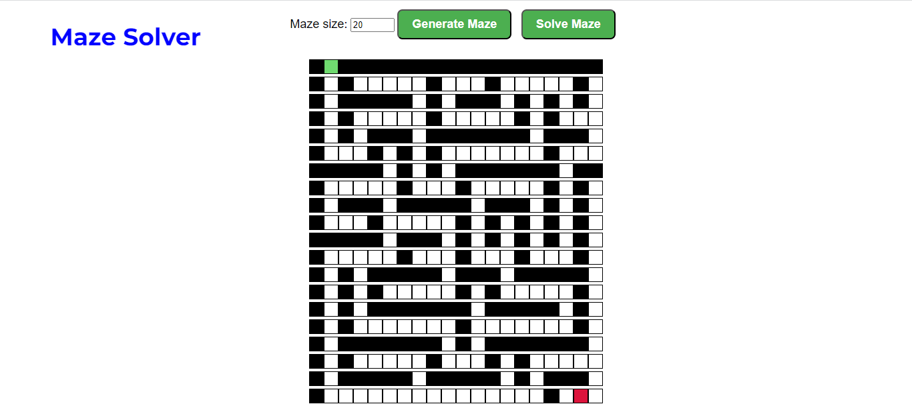
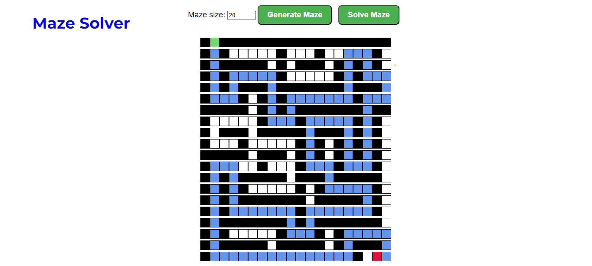

# Maze Solver


**Conteúdo da Disciplina**: Grafos1<br>

## Alunos
|Matrícula | Aluno |
| -- | -- |
| 19/0118555  |  Wengel Rodrigues Farias |


## Video da Apresentação

[Link do Vídeo](https://www.youtube.com/watch?v=9lbVdAesC2c)


## Sobre 
O projeto é um Maze Solver, um programa que representa um labirinto como um grafo, onde cada célula do labirinto é um nó do grafo e as paredes entre as células são as arestas. O objetivo é implementar o algoritmo de busca em largura (BFS) para encontrar o caminho mais rápido entre o nó inicial e o nó final do labirinto

## Screenshots


 

## Instalação 
**Linguagem**: Python<br>
**Framework**: Flask<br>

- ### Windows
Baixe o pacote Python do [site official](https://www.python.org/downloads/), e no momento da instação, marque a opção "Add Python to PATH" para no próximo passo instalar as dependências via terminal e rodar o projeto.

- ### Linux
Execute no terminal do linux a atualização dos pacotes e instalação do python3

```bash
sudo apt-get update
sudo apt-get install python3
```
# Execução
Abra um terminal na pasta **Script** do projeto e execute o comando:
```
.\start.bat
```
Abra outro terminal na pasta **Script** e execute  o comando:
```
.\venv.bat
```

## Uso 
Selecione o tamanho do labirinto que deseja criar, click em **Generate Maze** para gerar o labirinto e em **Solve Maze** para exibir o caminho mais rápido entre o inicio e o fim.

## Outros 
- É permitido que o usuário adicione ou remova paredes manualmente e ver como isso afeta a solucionabilidade do labirinto. Experimente!
- Para uma melhor experiencia, não utrapasse **50** de tamanho do labirinto.


